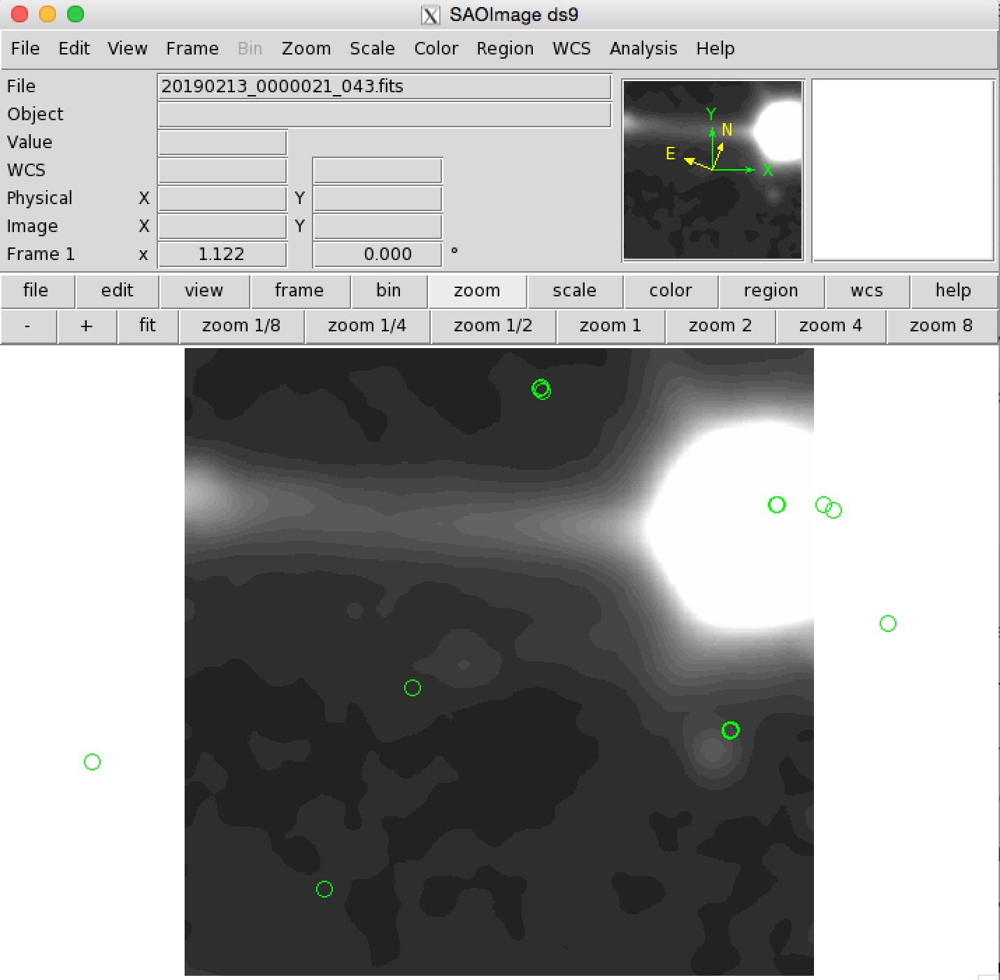
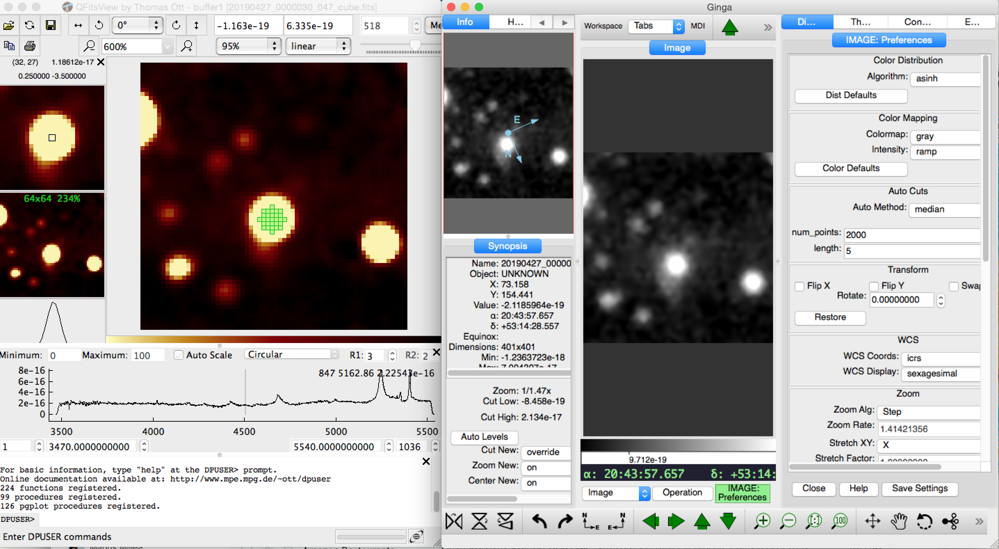

# Remedy v0.1 (Quick VIRUS Reduction Pipeline)

## Table of Contents
[Overview](https://github.com/grzeimann/Remedy/blob/master/README.md#Overview)

[Running Remedy](https://github.com/grzeimann/Remedy/blob/master/README.md#Running-Remedy)

[Download and Install](https://github.com/grzeimann/Remedy/blob/master/README.md#Download-and-Install)

[Data Products](https://github.com/grzeimann/Remedy/blob/master/README.md#Data-Products)

[Examples](https://github.com/grzeimann/Remedy/blob/master/README.md#Examples)

## Overview
Remedy is a quick reduction tool for VIRUS which reduces a target IFU or all IFUs in a given observation.  The pipeline should run quickly (~6-10 min) and produce an H5 file of flux-calibrated spectra for each fiber, calibration data for each fiber, extracted bright continuum sources in the field (Pan-STARRS sources), a catalog of emission-line detected sources, and a datacube of the target ifu.  The datacube can be viewed with QFitsView (http://www.mpe.mpg.de/~ott/QFitsView/). 

## Running Remedy
### Download and Install
Remedy is a code library that can be acquired simply with:
```
cd WHEREVER
git clone https://github.com/grzeimann/Remedy.git
```

Remedy relies on a calibration file (HDF5 file format: https://www.hdfgroup.org/solutions/hdf5/) and an fplane file.  A default calibration file will be kept up to date by the creator, Greg Zeimann, and can be acquired here:
```
cd WHEREVER/Remedy/CALS
scp username@wrangler.tacc.utexas.edu:/work/03730/gregz/maverick/output/general_calibration.h5 .
```

If you want to create your own calibration file: 
```
1) Log onto Wrangler on TACC
2) Get Remedy on TACC if you haven't already 
3) Add the following to your ~/.bashrc file if you haven't already
        export PATH=/home/00115/gebhardt/anaconda2/bin:/work/03946/hetdex/maverick/bin:$PATH
4) To create a new calibration file, run:
        python Remedy/build_calibration_h5file.py 20190822_20190828.h5 -r /work/03946/hetdex/maverick -i 047 -sd 20190822 -dl 7

        In this case I choose the night 20190822, and called it 20190822_20190828.h5
        
5) Copy calibration file to your desired Remedy/CALS folder
        cd WHEREVER/Remedy/CALS
        scp username@wrangler.tacc.utexas.edu:/PATH_ON_TACC/test_cal_20190112.h5 .
```

To get an fplane file with all ifuslots, simply copy:
```
cd WHEREVER/Remedy/CALS
scp username@wrangler.tacc.utexas.edu:/work/03730/gregz/maverick/fplaneall.txt .
```

### Setting up your Python environment
To begin on TACC, point to the common python environment. In your home "~/.bashrc" file, add the following line at the bottom:
```
export PATH=/home/00115/gebhardt/anaconda2/bin:/work/03946/hetdex/maverick/bin:$PATH
```

### Running the code
An example call to reduce ifuslot 043 on 20190204 and obseravtion 17 using the ifuslot 047 for sky is shown below:
```
python Remedy/quick_reduction.py 20190822 11 47 Remedy/CALS/20190822_20190828.h5 -nd 8 -fp Remedy/CALS/fplaneall.txt
```
To run at the mountain, replace the "--rootdir" as appropriate, the "--fplane_file" as approriate, and the calibration file if needed.  The other arguments will be specific to the choice of ifuslot and if you want to use another ifu for sky.

More details with respect to the input arguments are below.
```
usage: quick_reduction.py [-h] [-r ROOTDIR] [-ra RA] [-dec DEC]
                          [-fp FPLANE_FILE] [-nd NEIGHBOR_DIST]
                          [-sf SOURCE_FILE] [-s] [-sx SOURCE_X] [-sy SOURCE_Y]
                          [-ss SOURCE_SEEING]
                          date observation ifuslot hdf5file

positional arguments:
  date                  Date for reduction
  observation           Observation ID
  ifuslot               ifuslot to reduced
  hdf5file              HDF5 calibration file

optional arguments:
  -h, --help            show this help message and exit
  -r ROOTDIR, --rootdir ROOTDIR
                        Directory for raw data. (just before date folders)
  -ra RA, --ra RA       RA of the IFUSLOT to be reduced
  -dec DEC, --dec DEC   Dec of the IFUSLOT to be reduced
  -fp FPLANE_FILE, --fplane_file FPLANE_FILE
                        fplane file
  -nd NEIGHBOR_DIST, --neighbor_dist NEIGHBOR_DIST
                        Distance in x or y in the focal plane IFUSLOT units to
                        include in the reduction.
  -sf SOURCE_FILE, --source_file SOURCE_FILE
                        file for spectrum to add in cube
  -s, --simulate        Simulate source
  -sx SOURCE_X, --source_x SOURCE_X
                        x-position for spectrum to add in cube
  -sy SOURCE_Y, --source_y SOURCE_Y
                        y-position for spectrum to add in cube
  -ss SOURCE_SEEING, --source_seeing SOURCE_SEEING
                        seeing conditions manually entered
```
## Data Products

To be filled later, but there are two products ... {DATE}_{OBS}_{IFUSLOT}.fits and {DATE}_{OBS}_{IFUSLOT}_cube.fits

## About Remedy
The primary goals of the VIRUS data processing pipeline, Remedy, are to produce flux-calibrated fiber spectra, data cubes, and extracted continuum and emissin line sources. Remedy also tracks bad fiber spectra either due to regions of the CCD  with low QE, issues within the IFU spectrograph amplifiers, or ``bleeding`` effects of bright continuum sources. 

We begin by describing the basic CCD processing tasks and then discuss the more advanced steps.

### Basic Reduction Steps
VIRUS, at full capacity, is composed of 78 individual IFUs and each IFU is connected to a single spectrograph with two CCDs and four amplifiers.  Each of the amplifiers, 312 in all, has its own bias structure and dark current.  

#### Bias Subtraction
The bias level of an amplifier can be decomposed into a scalar offset and a vector containing structure over the 1032x1032 pixel frame. The scalar offset changes with exposure especially in the sequence of exposures. We use the overscan region in frame of interest to obtain the scalar offset. We measure the scalar offset with a biweight estimator, excluding the first two columns of the overscan region due to potential ''bleeding'' from the data section.  Typical scalar offsets are in the range of 1000.

There are two kinds of structure we've identified in a given VIRUS amplifier. The first is a weakly evolving large scale structure that is typically much less than the amplifier read noise, and is removed easily from a master frame built over the night or even month.  The second structure is on the pixel to pixel scale and is more akin to a  interference pattern.  This structure changes rapidly throughout the night and is not easily removed.  It is however only ~1 electron in amplitude and even less when average over a fiber in the trace direction.  As the only modelable structure is weakly evolving with time, we opt not to make a master bias frame on a night by night basis or even month by month basis and rather allow the master dark frame to capture the weakly evolving large scale structure and not make a master bias frame at all.

#### Dark Subtraction
The dark current in VIRUS amplifiers have <0.5 electrons in 360s exposures. In a given night, we take between 1 and 10 dark frames.  We thus build a master dark frame, which includes the dark current, large scale bias structure, and some small scale pixel to pixel  interference structure.  The master dark frame time window is a user input, and typically a period of 21 days.

#### Pixel Mask
From the master dark frame we look for hot pixels and low level charge traps to be masked out later in processing.  We first subtract the median value in each column from the master dark to take out the large scale columnar pattern. We then subtract the median value in each row to similarly remove low level readout pattern.  Finally, we apply a sigma clipping algorithm to identify 5-sigma outliers and mask all of these pixels.  Outliers are mostly hot pixels and the base of low level charge traps.

#### Fiber Trace
The trace of the fibers or distortion map can be measured from high count observations like flat-field lamps or twilights.  For an individual fiber, we use the peak pixel and use the two neighboring pixels to define a quadratic function.  The peak of the quadratic function is then used as the  trace of the fiber for a given column.  To smooth the individual measurements across columns, we use a third order polynomial fit.

We measure the trace from a master twilight taken over an input time range, typically 7 days.  The trace is quite stable.  The night to night drift, driven primarily by the ambient temperature, is <~0.2 pixels for an individual fiber and elastic in nature as it shifts around a stable location. By averaging many nights, we essentially are measuring the trace for the  stable location and then for each observation we find a single shift to the new location.

#### Fiber Wavelength
The wavelength solution for each fiber is obtained from Hg and Cd arc lamps.  We create a master arc over an input time range, typically 7 days, and use an peak finding algorithm with a priori knowledge  of the wavelength of the bright lines to solve for the wavelength for each fiber. This creates a  stable wavelength solution, but like the fiber trace, typical shifts of <~0.2 pixels occur due to changes in the ambient temperature.  We currently do not adjust for these wavelength shifts.

#### Scattered Light - Spectrograph
Due to imperfections in the mirrors within each spectrograph, light from the fiber cables is scattered on the CCD creating a background that needs to be accounted for and subtracted.  The scattered light can be modeled as a powerlaw in which a monochromatic intensity for a given fiber has a profile that falls off proportional to 1 / pixel distance.   We find that when we add up light in the central core of fibers and compare that to the total light in the CCD,  roughly 3-4% of the incident fiber light is scattered into this smoother background.  We model this background light in the master twilight frames by first creating a power-law model for the scattered light and then normalize that model to the observed master frame.  We then model the scattered light in the science frame by scaling the background model as a function of wavelength to account for differences between the smoothed twilight incident spectrum and the smoothed average observed science spectrum.  We finally subtract this background model and consider the light lost due to the system rather than trying to account for it in post-processing.

### Advanced Reduction Steps

#### Fiber Extraction

#### Sky Subtraction

#### Source Extraction

#### Astrometric Calibration

#### Flux Calibration


## Examples

Running on TACC with following command:
```
python Remedy/quick_reduction.py 20190213 21 43 Remedy/CALS/test_cal_20190112.h5 --sky_ifuslot 47 --fplane_file fplane20190129.txt --rootdir /work/03946/hetdex/maverick
```
You can see the reduction of an IFU with a g'~12 star in it.  At this brightness, sky subtraction is inherently difficult, but using ifuslot 047 for sky information, we can see both a good job in sky subtraction and the expected diffraction spikes from such a bright star.  Below I am showing the output 20190213_0000021_043.fits image in ds9 and the 20190213_0000021_043_cube.fits cube in QFitsView.


<p align="center">
  
</p>

<p align="center">
  
</p>
